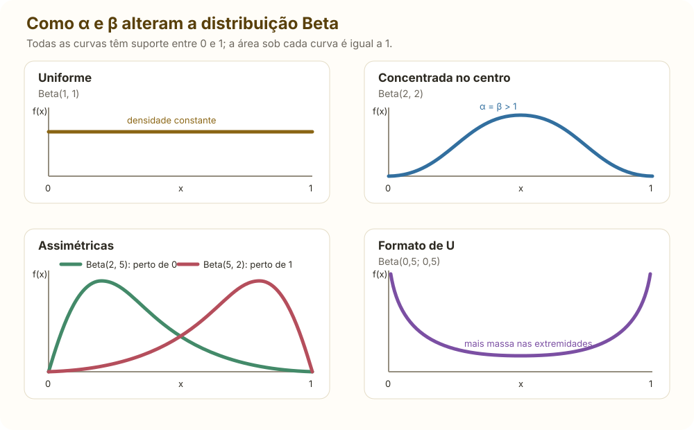

# Resumo do livro — Probabilidade

> Síntese direta dos capítulos 1 a 7 de *Introduction to Probability, Statistics, and Random Processes*, de Hossein Pishro-Nik. Esta página cobre somente probabilidade; inferência estatística, estimação, intervalos de confiança, testes e regressão não fazem parte deste resumo.

## 1. Fundamentos

### Experimento, espaço amostral e eventos

- **Experimento aleatório:** procedimento cujo resultado não é conhecido de antemão.
- **Espaço amostral** \(\Omega\): conjunto de todos os resultados possíveis.
- **Evento:** subconjunto \(A\subseteq\Omega\).
- **Complemento:** \(A^c=\Omega\setminus A\).
- **União:** \(A\cup B\), ocorre pelo menos um dos eventos.
- **Interseção:** \(A\cap B\), ocorrem ambos.
- **Eventos disjuntos:** \(A\cap B=\varnothing\).

Leis de De Morgan:

\[
(A\cup B)^c=A^c\cap B^c,
\qquad
(A\cap B)^c=A^c\cup B^c.
\]

### Axiomas e identidades

\[
P(A)\ge0,
\qquad P(\Omega)=1,
\qquad
P\!\left(\bigcup_i A_i\right)=\sum_iP(A_i)
\]

na última igualdade, para eventos \(A_i\) disjuntos. Consequências:

\[
P(\varnothing)=0,
\qquad P(A^c)=1-P(A),
\]

\[
P(A\cup B)=P(A)+P(B)-P(A\cap B),
\]

\[
P\!\left(\bigcup_{i=1}^n A_i\right)
=\sum_{k=1}^n(-1)^{k+1}
\sum_{1\le i_1<\cdots<i_k\le n}
P(A_{i_1}\cap\cdots\cap A_{i_k})
\quad\text{(inclusão–exclusão)}.
\]

\[
P(A\setminus B)=P(A)-P(A\cap B),
\qquad
P(A\cup B)\le P(A)+P(B).
\]

Em um espaço finito equiprovável, \(P(A)=|A|/|\Omega|\).

### Probabilidade condicional, independência e Bayes

Para \(P(B)>0\):

\[
P(A\mid B)=\frac{P(A\cap B)}{P(B)},
\qquad
P(A\cap B)=P(A\mid B)P(B).
\]

Se \(H_1,\ldots,H_m\) é uma partição de \(\Omega\), o denominador pode ser calculado pela lei da probabilidade total:

\[
P(B)=\sum_{i=1}^{m}P(B\mid H_i)P(H_i).
\]

Em particular, usando a partição \(\{A,A^c\}\):

\[
\boxed{P(B)=P(B\mid A)P(A)+P(B\mid A^c)P(A^c)}
\]

ou, como \(P(A^c)=1-P(A)\),

\[
P(B)=P(B\mid A)P(A)+P(B\mid A^c)[1-P(A)].
\]

Regra da cadeia:

\[
P(A_1\cap\cdots\cap A_n)
=P(A_1)\prod_{i=2}^nP(A_i\mid A_1\cap\cdots\cap A_{i-1}).
\]

Os eventos \(A\) e \(B\) são independentes quando

\[
P(A\cap B)=P(A)P(B).
\]

Independência condicional dado \(C\):

\[
P(A\cap B\mid C)=P(A\mid C)P(B\mid C).
\]

Se \(B_1,\ldots,B_m\) é uma partição de \(\Omega\), então:

\[
P(A)=\sum_{i=1}^mP(A\mid B_i)P(B_i)
\quad\text{(lei da probabilidade total)},
\]

\[
P(B_j\mid A)=
\frac{P(A\mid B_j)P(B_j)}
{\sum_iP(A\mid B_i)P(B_i)}
\quad\text{(regra de Bayes)}.
\]

Em Bayes, \(P(B_j)\) é a priori, \(P(A\mid B_j)\) é a verossimilhança, \(P(A)\) é a evidência e \(P(B_j\mid A)\) é a posteriori.

## 2. Contagem

| Situação: escolher \(k\) posições a partir de \(n\) tipos | Número de resultados |
|---|---:|
| Ordem importa, com repetição | \(n^k\) |
| Ordem importa, sem repetição | \(P(n,k)=\dfrac{n!}{(n-k)!}\) |
| Ordem não importa, sem repetição | \(\binom nk=\dfrac{n!}{k!(n-k)!}\) |
| Ordem não importa, com repetição | \(\binom{n+k-1}{k}\) |

Permutações de \(n\) objetos com grupos repetidos de tamanhos \(n_1,\ldots,n_r\):

\[
\frac{n!}{n_1!\cdots n_r!},
\qquad n_1+\cdots+n_r=n.
\]

Coeficiente multinomial:

\[
\binom{n}{n_1,\ldots,n_r}=\frac{n!}{n_1!\cdots n_r!}.
\]

Identidades úteis:

\[
\binom nk=\binom n{n-k},
\qquad
\binom nk=\binom{n-1}{k}+\binom{n-1}{k-1},
\qquad
\sum_{k=0}^n\binom nk=2^n.
\]

## 3. Uma variável aleatória

Uma **variável aleatória** é uma função \(X:\Omega\to\mathbb R\). Seu suporte é o conjunto de valores que pode assumir.

### Caso discreto

\[
p_X(x)=P(X=x),
\qquad p_X(x)\ge0,
\qquad \sum_xp_X(x)=1.
\]

\[
F_X(x)=P(X\le x)=\sum_{u\le x}p_X(u).
\]

Nos pontos de massa:

\[
p_X(x)=F_X(x)-F_X(x^-),
\qquad
F_X(x^-)=\lim_{t\uparrow x}F_X(t).
\]

### Caso contínuo

\[
f_X(x)\ge0,
\qquad \int_{-\infty}^{\infty}f_X(x)\,dx=1,
\]

\[
F_X(x)=\int_{-\infty}^{x}f_X(t)\,dt,
\qquad
P(a<X\le b)=F_X(b)-F_X(a).
\]

Quando \(F_X\) é derivável no ponto \(x\), a densidade é a derivada da função de distribuição acumulada:

\[
f_X(x)=\frac{d}{dx}F_X(x).
\]

Para uma variável contínua, \(P(X=x)=0\). A densidade \(f_X(x)\) não é uma probabilidade pontual e pode ser maior que 1; probabilidades são obtidas pela área sob a densidade em um intervalo.

Toda CDF é não decrescente, contínua à direita e satisfaz
\[
\lim_{x\to-\infty}F_X(x)=0,
\qquad
\lim_{x\to\infty}F_X(x)=1.
\]

### Esperança, momentos e variância

\[
E[g(X)]=\sum_xg(x)p_X(x)
\quad\text{ou}\quad
E[g(X)]=\int_{-\infty}^{\infty}g(x)f_X(x)\,dx.
\]

\[
\mu=E[X],
\qquad
E[X^k]\text{ é o momento de ordem }k,
\]

\[
Var(X)=E[(X-\mu)^2]=E[X^2]-E[X]^2,
\qquad
\sigma_X=\sqrt{Var(X)}.
\]

\[
E[aX+b]=aE[X]+b,
\qquad
Var(aX+b)=a^2Var(X).
\]

Para \(X\ge0\):

\[
E[X]=\int_0^\infty P(X>t)\,dt.
\]

### Transformações

Se \(Y=g(X)\), no caso discreto:

\[
p_Y(y)=\sum_{x:g(x)=y}p_X(x).
\]

No caso contínuo, se \(g\) é estritamente monótona:

\[
f_Y(y)=f_X(g^{-1}(y))
\left|\frac{d}{dy}g^{-1}(y)\right|.
\]

Com vários ramos \(x_i\) que satisfazem \(g(x_i)=y\):

\[
f_Y(y)=\sum_i\frac{f_X(x_i)}{|g'(x_i)|}.
\]

### Quantis

O quantil de ordem \(p\), com \(0<p<1\), é o valor \(q_p\) abaixo do qual está uma proporção \(p\) da probabilidade. Se \(F_X\) é contínua e estritamente crescente:

\[
F_X(q_p)=p
\qquad\Longleftrightarrow\qquad
\boxed{q_p=F_X^{-1}(p)}.
\]

Para qualquer CDF, inclusive quando há saltos ou trechos planos, usa-se a definição generalizada:

\[
\boxed{
q_p=\inf\left\{\,x\in\mathbb{R}\;:\;F_X(x)\ge p\,\right\}
}.
\]

O operador \(\inf\) significa **ínfimo**: o menor limite inferior do conjunto. Em uma distribuição discreta, essa mesma ideia normalmente pode ser escrita de forma mais intuitiva como

\[
q_p=\min\left\{\,x\in S_X\;:\;F_X(x)\ge p\,\right\},
\]

em que \(S_X\) é o suporte de \(X\). Assim, \(q_p\) é o primeiro valor em que a probabilidade acumulada alcança ou ultrapassa \(p\).

A mediana é \(q_{0{,}5}\); os quartis são \(q_{0{,}25}\), \(q_{0{,}5}\) e \(q_{0{,}75}\).

## 4. Distribuições essenciais

### Discretas

| Distribuição e suporte | PMF | Média | Variância |
|---|---|---:|---:|
| Bernoulli \(\operatorname{Bern}(p)\), \(X\in\{0,1\}\) | \(p^x(1-p)^{1-x}\) | \(p\) | \(p(1-p)\) |
| Binomial \(\operatorname{Bin}(n,p)\), \(k=0,\ldots,n\) | \(\binom nkp^k(1-p)^{n-k}\) | \(np\) | \(np(1-p)\) |
| Geométrica \(\operatorname{Geom}(p)\), \(k=1,2,\ldots\) | \((1-p)^{k-1}p\) | \(1/p\) | \((1-p)/p^2\) |
| Binomial negativa \(\operatorname{NegBin}(r,p)\): ensaio do \(r\)-ésimo sucesso | \(\binom{k-1}{r-1}p^r(1-p)^{k-r}\) | \(r/p\) | \(r(1-p)/p^2\) |
| Poisson \(\operatorname{Pois}(\lambda)\), \(k=0,1,\ldots\) | \(e^{-\lambda}\lambda^k/k!\) | \(\lambda\) | \(\lambda\) |
| Hipergeométrica \(\operatorname{Hipergeom}(N,K,n)\) | \(\dfrac{\binom Kk\binom{N-K}{n-k}}{\binom Nn}\) | \(nK/N\) | \(n\frac KN(1-\frac KN)\frac{N-n}{N-1}\) |

#### Quando usar cada distribuição discreta

| Distribuição | Use quando a variável representa | Características principais |
|---|---|---|
| Bernoulli | O resultado de um único ensaio: sucesso ou fracasso | Apenas \(0\) ou \(1\); parâmetro \(p=P(X=1)\) |
| Binomial | O número de sucessos em \(n\) ensaios independentes, todos com o mesmo \(p\) | Número \(n\) fixo de ensaios; há reposição ou independência equivalente |
| Geométrica | O número de ensaios até o primeiro sucesso | Suporte começa em \(1\); possui a propriedade sem memória |
| Binomial negativa | O número de ensaios até o \(r\)-ésimo sucesso | Generaliza a geométrica; \(r\) é fixo e os ensaios têm o mesmo \(p\) |
| Poisson | O número de ocorrências em um intervalo de tempo, comprimento, área ou volume | Taxa média constante e ocorrências independentes; média e variância iguais a \(\lambda\) |
| Hipergeométrica | O número de sucessos em \(n\) retiradas sem reposição de uma população finita | As retiradas são dependentes; use \(N\) para o tamanho da população e \(K\) para o total de sucessos |

Para um processo com taxa \(\nu\) por unidade e intervalo de tamanho \(t\), o parâmetro da contagem de Poisson é \(\lambda=\nu t\).

Aproximações frequentes:

\[
\operatorname{Bin}(n,p)\approx \operatorname{Pois}(np)
\quad\text{quando \(n\) é grande e \(p\) é pequeno},
\]

\[
\operatorname{Bin}(n,p)\approx N(np,np(1-p))
\quad\text{quando \(np\) e \(n(1-p)\) são suficientemente grandes}.
\]

Na aproximação normal de uma variável inteira, use a correção de continuidade; por exemplo,
\[
P(X\le k)\approx P(Y\le k+0{,}5).
\]

Propriedade sem memória da geométrica:

\[
P(X>m+n\mid X>m)=P(X>n).
\]

### Contínuas

| Distribuição | PDF no suporte | Média | Variância |
|---|---|---:|---:|
| Uniforme \(U(a,b)\) | \(1/(b-a)\) | \((a+b)/2\) | \((b-a)^2/12\) |
| Exponencial \(\operatorname{Exp}(\lambda)\) | \(\lambda e^{-\lambda x},\ x\ge0\) | \(1/\lambda\) | \(1/\lambda^2\) |
| Normal \(N(\mu,\sigma^2)\) | \(\dfrac1{\sigma\sqrt{2\pi}}e^{-(x-\mu)^2/(2\sigma^2)}\) | \(\mu\) | \(\sigma^2\) |
| Gamma forma–taxa \(\operatorname{Gamma}(\alpha,\lambda)\) | \(\dfrac{\lambda^\alpha}{\Gamma(\alpha)}x^{\alpha-1}e^{-\lambda x}\) | \(\alpha/\lambda\) | \(\alpha/\lambda^2\) |
| Erlang \(\operatorname{Erlang}(k,\lambda)\), \(k=1,2,\ldots\) | \(\dfrac{\lambda^k}{(k-1)!}x^{k-1}e^{-\lambda x},\ x\ge0\) | \(k/\lambda\) | \(k/\lambda^2\) |
| Beta \(\operatorname{Beta}(\alpha,\beta)\), \(0<x<1\) | \(\dfrac{x^{\alpha-1}(1-x)^{\beta-1}}{B(\alpha,\beta)}\) | \(\dfrac\alpha{\alpha+\beta}\) | \(\dfrac{\alpha\beta}{(\alpha+\beta)^2(\alpha+\beta+1)}\) |
| Qui-quadrado \(\chi^2_k\) | \(\operatorname{Gamma}(k/2,\text{taxa }1/2)\) | \(k\) | \(2k\) |
| Cauchy padrão | \(1/[\pi(1+x^2)]\) | não existe | não existe |

#### Parâmetros da Gamma e da Erlang

O símbolo \(\Gamma(\alpha)\) no denominador da PDF é a **função Gamma**, não uma nova variável nem uma probabilidade. Ela funciona como constante de normalização, fazendo a área total sob a densidade ser igual a \(1\):

\[
\Gamma(\alpha)=\int_0^\infty u^{\alpha-1}e^{-u}\,du.
\]

Ela generaliza o fatorial. Para inteiros positivos,

\[
\Gamma(k)=(k-1)!.
\]

Na parametrização **forma–taxa**, usada nesta página:

- \(\alpha>0\) é a **forma**: controla o formato e a assimetria da curva. Na Erlang, a forma é o inteiro \(k\), correspondente ao número de etapas ou eventos aguardados;
- \(\lambda>0\) é a **taxa**, com unidade inversa à de \(X\). Na interpretação de espera de um processo de Poisson, ela mede quantos eventos são esperados por unidade de tempo. Quanto maior \(\lambda\), menor tende a ser o tempo de espera;
- a média e a variância são \(E[X]=\alpha/\lambda\) e \(Var(X)=\alpha/\lambda^2\).

Alguns livros usam a parametrização **forma–escala**. A escala \(\theta\) tem a mesma unidade de \(X\); na interpretação de espera, representa o tempo médio por etapa. Ela é o inverso da taxa:

\[
\boxed{\theta=\frac1\lambda}
\qquad\Longleftrightarrow\qquad
\boxed{\lambda=\frac1\theta}.
\]

Com escala, a mesma densidade é escrita como

\[
f_X(x)=
\frac{1}{\Gamma(\alpha)\theta^\alpha}
x^{\alpha-1}e^{-x/\theta},
\qquad x>0,
\]

e

\[
E[X]=\alpha\theta,
\qquad
Var(X)=\alpha\theta^2.
\]

Portanto, antes de usar uma fórmula Gamma, verifique se o segundo parâmetro é uma **taxa** \(\lambda\) ou uma **escala** \(\theta\).

#### Quando usar cada distribuição contínua

| Distribuição | Use quando a variável representa | Características principais |
|---|---|---|
| Uniforme | Um valor em \([a,b]\) sem preferência por nenhuma região do intervalo | Densidade constante e suporte limitado |
| Exponencial | O tempo até a primeira ocorrência de um processo de Poisson ou uma duração com taxa de falha constante | Positiva, assimétrica à direita e sem memória |
| Gamma | Um tempo ou uma quantidade positiva cuja forma pode variar além do modelo exponencial | \(\alpha\) pode ser qualquer número positivo; quando \(\alpha\) é inteiro, é uma soma de exponenciais de mesma taxa |
| Erlang | O tempo até o \(k\)-ésimo evento de um processo de Poisson | Caso Gamma com forma inteira \(k\); soma de \(k\) exponenciais independentes de mesma taxa |
| Normal | Uma medida aproximadamente simétrica ou a soma/média de muitos efeitos pequenos | Determinada por \(\mu\) e \(\sigma^2\); simétrica e fechada sob combinações lineares independentes |
| Beta | Uma proporção ou probabilidade limitada ao intervalo \((0,1)\) | Muito flexível: pode ser uniforme, simétrica, assimétrica ou em forma de U |
| Qui-quadrado | Uma soma de quadrados de normais padrão independentes | Positiva e assimétrica à direita; torna-se menos assimétrica com mais graus de liberdade |
| Cauchy | Um fenômeno com caudas extremamente pesadas, como a razão de duas normais padrão independentes | Não possui média nem variância; a média amostral não se estabiliza como no caso usual |

A função Beta que aparece na densidade de \(\operatorname{Beta}(\alpha,\beta)\) é

\[
B(\alpha,\beta)=\frac{\Gamma(\alpha)\Gamma(\beta)}{\Gamma(\alpha+\beta)}.
\]

Exponencial:

\[
F_X(x)=1-e^{-\lambda x},
\qquad
P(X>x)=e^{-\lambda x},
\]

\[
P(X>s+t\mid X>s)=P(X>t).
\]

Normal e padronização:

\[
Z=\frac{X-\mu}{\sigma}\sim N(0,1),
\]

\[
P(a<X<b)=\Phi\!\left(\frac{b-\mu}{\sigma}\right)
-\Phi\!\left(\frac{a-\mu}{\sigma}\right).
\]

#### Exemplo numérico de padronização

Suponha que

\[
X\sim N(100,15^2).
\]

Aqui, \(\mu=100\), \(\sigma^2=15^2=225\) e, portanto, o desvio-padrão é \(\sigma=15\). A variável padronizada é

\[
Z=\frac{X-100}{15}\sim N(0,1).
\]

Por exemplo, o valor \(X=130\) corresponde a

\[
z=\frac{130-100}{15}=2.
\]

Isso significa que \(130\) está a dois desvios-padrão acima da média. Para calcular \(P(85<X<130)\), padronizamos os dois limites:

\[
\frac{85-100}{15}=-1,
\qquad
\frac{130-100}{15}=2.
\]

Logo,

\[
\begin{aligned}
P(85<X<130)
&=P(-1<Z<2)\\
&=\Phi(2)-\Phi(-1)\\
&\approx 0{,}9772-0{,}1587\\
&=\boxed{0{,}8185}.
\end{aligned}
\]

Portanto, a probabilidade de \(X\) ficar entre \(85\) e \(130\) é aproximadamente \(81{,}85\%\).

Regra 68–95–99,7%: aproximadamente 68%, 95% e 99,7% da massa normal ficam a 1, 2 e 3 desvios-padrão da média.

Gamma representa, entre outras aplicações, o tempo até o \(\alpha\)-ésimo evento de um processo de Poisson quando \(\alpha\) é inteiro (Erlang). Se \(T_k\) é o tempo até o \(k\)-ésimo evento:

\[
P(T_k\le t)=P(N(t)\ge k).
\]

#### Como as distribuições se relacionam

**Bernoulli, Binomial, Geométrica e Binomial negativa.** Se \(X_1,\ldots,X_n\) são Bernoulli independentes com o mesmo \(p\), então

\[
\sum_{i=1}^{n}X_i\sim \operatorname{Bin}(n,p).
\]

Cada Bernoulli registra se houve sucesso em **um** ensaio. Somar \(n\) indicadores Bernoulli equivale a contar quantos sucessos ocorreram nos \(n\) ensaios, produzindo a Binomial.

A Geométrica espera apenas o **primeiro** sucesso. A Binomial negativa repete essa espera até acumular \(r\) sucessos; por isso, a Geométrica é o caso \(r=1\), e a soma de \(r\) esperas geométricas independentes com o mesmo \(p\) tem distribuição Binomial negativa.

**Poisson, Exponencial, Gamma e Erlang.** Em um processo de Poisson de taxa \(\lambda\):

\[
N(t)\sim \operatorname{Pois}(\lambda t),
\qquad
W_i\sim \operatorname{Exp}(\lambda),
\]

\[
T_k=W_1+\cdots+W_k
\sim \operatorname{Erlang}(k,\lambda)
=\operatorname{Gamma}(k,\lambda),
\]

em que \(W_1,\ldots,W_k\) são os tempos independentes entre eventos e \(T_k\) é o tempo até o \(k\)-ésimo evento. Assim, Poisson conta **quantos eventos** ocorreram, enquanto Exponencial, Erlang e Gamma modelam **quanto tempo** se espera.

Em outras palavras:

- \(N(t)\) responde “quantos eventos ocorreram até o tempo \(t\)?”;
- \(W_1\) responde “quanto tempo até o primeiro evento?”;
- \(T_k\) responde “quanto tempo até completar \(k\) eventos?”.

Por isso, “o \(k\)-ésimo evento ocorreu até \(t\)” e “pelo menos \(k\) eventos ocorreram até \(t\)” descrevem exatamente o mesmo acontecimento:

\[
\{T_k\le t\}=\{N(t)\ge k\}.
\]

Relações particulares da família Gamma:

\[
\operatorname{Exp}(\lambda)=\operatorname{Gamma}(1,\lambda),
\qquad
\operatorname{Erlang}(k,\lambda)=\operatorname{Gamma}(k,\lambda),
\qquad
\chi_\nu^2=\operatorname{Gamma}\!\left(\frac{\nu}{2},\frac12\right).
\]

Se \(G_1\sim \operatorname{Gamma}(\alpha_1,\lambda)\) e \(G_2\sim \operatorname{Gamma}(\alpha_2,\lambda)\) são independentes e têm a mesma taxa:

\[
G_1+G_2\sim \operatorname{Gamma}(\alpha_1+\alpha_2,\lambda).
\]

A Exponencial representa uma única etapa de espera. A Erlang soma um número inteiro \(k\) dessas etapas. A Gamma mantém a mesma estrutura, mas permite qualquer forma \(\alpha>0\), oferecendo maior flexibilidade. Ao somar Gammas independentes de **mesma taxa**, as formas se somam; se as taxas forem diferentes, essa regra simples não vale.

O Qui-quadrado também pertence à família Gamma: seus graus de liberdade \(\nu\) determinam a forma \(\nu/2\), enquanto sua taxa é \(1/2\).

**Normal e Qui-quadrado.** Se \(Z_1,\ldots,Z_\nu\) são normais padrão independentes:

\[
\sum_{i=1}^{\nu}Z_i^2\sim\chi_\nu^2.
\]

Somas de normais independentes continuam normais: as médias se somam e, por independência, as variâncias também. Já elevar normais padrão ao quadrado elimina o sinal e produz parcelas positivas; a soma de \(\nu\) desses quadrados gera um Qui-quadrado com \(\nu\) graus de liberdade.

A Normal também surge aproximadamente para somas e médias de muitas variáveis, mesmo que as parcelas originais não sejam normais, pelas condições do Teorema Central do Limite.

**Beta e Uniforme.**

\[
\operatorname{Beta}(1,1)=U(0,1).
\]

Na Beta, os parâmetros \(\alpha\) e \(\beta\) controlam onde a densidade se concentra. Com \(\alpha=\beta=1\), não há região preferida e surge a Uniforme em \((0,1)\). Se \(\alpha>\beta\), há maior concentração perto de \(1\); se \(\beta>\alpha\), perto de \(0\). Quando ambos são maiores que \(1\), a massa tende ao interior; quando ambos são menores que \(1\), tende às extremidades.

<figure class="concept-figure">
  
  <figcaption>A Beta(1,1) é uniforme; parâmetros maiores que 1 podem concentrar a massa no interior, parâmetros desiguais deslocam a concentração e parâmetros menores que 1 favorecem as extremidades.</figcaption>
</figure>

**Binomial, Hipergeométrica, Poisson e Normal.**

- A Hipergeométrica usa retiradas sem reposição. Quando a amostra é pequena diante da população, retirar um item quase não altera as probabilidades seguintes; por isso ela se aproxima de \(\operatorname{Bin}(n,K/N)\).
- A Binomial se aproxima da Poisson quando há muitos ensaios, cada sucesso é raro e \(np\) permanece em uma escala moderada. A Poisson simplifica a contagem desses eventos raros.
- A Binomial se aproxima da Normal quando as quantidades esperadas de sucessos, \(np\), e fracassos, \(n(1-p)\), são suficientemente grandes. Nesse caso, a distribuição discreta fica aproximadamente simétrica e em forma de sino.

**Exemplo — defeitos raros.** Uma fábrica produz \(1\,000\) peças, e cada peça tem probabilidade \(p=0{,}002\) de apresentar defeito, independentemente das demais. Se \(X\) é o número de peças defeituosas:

\[
X\sim\operatorname{Bin}(1000,0{,}002),
\qquad
\lambda=np=1000(0{,}002)=2.
\]

A probabilidade binomial exata de encontrar exatamente três peças defeituosas é

\[
\begin{aligned}
P(X=3)
&=\binom{1000}{3}(0{,}002)^3(0{,}998)^{997}\\
&\approx 0{,}1806.
\end{aligned}
\]

Como \(n\) é grande, \(p\) é pequeno e \(np=2\), podemos usar \(Y\sim\operatorname{Pois}(2)\):

\[
\begin{aligned}
P(Y=3)
&=e^{-2}\frac{2^3}{3!}\\
&\approx 0{,}1804.
\end{aligned}
\]

Os resultados são muito próximos: aproximadamente \(18{,}06\%\) pela Binomial e \(18{,}04\%\) pela Poisson. A vantagem da Poisson é substituir o coeficiente \(\binom{1000}{3}\) por uma conta bem mais simples.

### Variáveis mistas

Uma variável mista combina massas \(P(X=a_j)=p_j\) e uma parte contínua \(f_c\):

\[
\sum_jp_j+\int f_c(x)\,dx=1,
\]

\[
E[g(X)]=\sum_jg(a_j)p_j+\int g(x)f_c(x)\,dx.
\]

Usando a delta de Dirac, a parte discreta também pode ser escrita dentro de uma “densidade generalizada”:

\[
f_X(x)=\sum_j p_j\,\delta(x-a_j)+f_c(x),
\qquad
\int_{-\infty}^{\infty}g(x)\delta(x-a)\,dx=g(a).
\]

## 5. Distribuições conjuntas

### Funções conjuntas e marginais

\[
F_{X,Y}(x,y)=P(X\le x,Y\le y).
\]

Caso discreto:

\[
p_{X,Y}(x,y)=P(X=x,Y=y),
\quad
p_X(x)=\sum_yp_{X,Y}(x,y).
\]

Caso contínuo:

\[
P((X,Y)\in R)=\iint_Rf_{X,Y}(x,y)\,dxdy,
\quad
f_X(x)=\int_{-\infty}^{\infty}f_{X,Y}(x,y)\,dy.
\]

Condicionais:

\[
p_{Y\mid X}(y\mid x)=\frac{p_{X,Y}(x,y)}{p_X(x)},
\qquad
f_{Y\mid X}(y\mid x)=\frac{f_{X,Y}(x,y)}{f_X(x)}.
\]

Independência:

\[
F_{X,Y}=F_XF_Y,
\qquad
p_{X,Y}=p_Xp_Y
\quad\text{ou}\quad
f_{X,Y}=f_Xf_Y.
\]

### Esperança conjunta e condicional

\[
E[g(X,Y)]=\sum_x\sum_yg(x,y)p_{X,Y}(x,y)
\]

ou a integral dupla correspondente. A esperança é linear sem exigir independência:

\[
E\!\left[\sum_i a_iX_i\right]=\sum_i a_iE[X_i].
\]

Para valores com probabilidade ou densidade marginal positiva:

\[
E[Y\mid X=x]=\sum_y y\,p_{Y\mid X}(y\mid x)
\quad\text{ou}\quad
E[Y\mid X=x]=\int_{-\infty}^{\infty}y\,f_{Y\mid X}(y\mid x)\,dy.
\]

Lei da esperança total:

\[
E[Y]=E[E[Y\mid X]].
\]

Lei da variância total:

\[
Var(Y)=E[Var(Y\mid X)]+Var(E[Y\mid X]).
\]

### Covariância e correlação

\[
Cov(X,Y)=E[XY]-E[X]E[Y],
\]

\[
\rho_{X,Y}=\frac{Cov(X,Y)}{\sigma_X\sigma_Y},
\qquad -1\le\rho\le1.
\]

\[
Var\!\left(\sum_i a_iX_i\right)
=\sum_i a_i^2Var(X_i)+2\sum_{i<j}a_ia_jCov(X_i,X_j).
\]

Independência implica covariância zero quando os momentos existem; o inverso não vale em geral. Para variáveis conjuntamente normais, covariância zero implica independência.

### Normal bivariada

Se \(X\) e \(Y\) são conjuntamente normais, com médias \(\mu_X,\mu_Y\), desvios-padrão \(\sigma_X,\sigma_Y\) e correlação \(\rho\), \(|\rho|<1\), então:

\[
f_{X,Y}(x,y)=
\frac{1}{2\pi\sigma_X\sigma_Y\sqrt{1-\rho^2}}
\exp\!\left\{-\frac{1}{2(1-\rho^2)}
\left[
\frac{(x-\mu_X)^2}{\sigma_X^2}
-\frac{2\rho(x-\mu_X)(y-\mu_Y)}{\sigma_X\sigma_Y}
+\frac{(y-\mu_Y)^2}{\sigma_Y^2}
\right]\right\}.
\]

As marginais são normais. Nesse modelo, \(\rho=0\) equivale à independência entre \(X\) e \(Y\).

### Somas, extremos e transformações bidimensionais

Para \(Z=X+Y\), com \(X,Y\) independentes:

\[
p_Z(z)=\sum_xp_X(x)p_Y(z-x),
\]

\[
f_Z(z)=\int_{-\infty}^{\infty}f_X(x)f_Y(z-x)\,dx.
\]

Fechamentos úteis para variáveis independentes:

\[
\operatorname{Bin}(n_1,p)+\operatorname{Bin}(n_2,p)
\sim \operatorname{Bin}(n_1+n_2,p),
\]

\[
\operatorname{Pois}(\lambda_1)+\operatorname{Pois}(\lambda_2)
\sim \operatorname{Pois}(\lambda_1+\lambda_2),
\]

\[
N(\mu_1,\sigma_1^2)+N(\mu_2,\sigma_2^2)
\sim N(\mu_1+\mu_2,\sigma_1^2+\sigma_2^2),
\]

\[
\operatorname{Gamma}(\alpha_1,\lambda)+\operatorname{Gamma}(\alpha_2,\lambda)
\sim \operatorname{Gamma}(\alpha_1+\alpha_2,\lambda).
\]

Para variáveis independentes:

\[
F_{\max(X_1,\ldots,X_n)}(t)=\prod_iF_{X_i}(t),
\]

\[
P(\min(X_1,\ldots,X_n)>t)=\prod_i[1-F_{X_i}(t)].
\]

Se \((U,V)=g(X,Y)\) é uma transformação bijetiva diferenciável, com inversa \((x(u,v),y(u,v))\):

\[
f_{U,V}(u,v)=f_{X,Y}(x(u,v),y(u,v))
\left|\frac{\partial(x,y)}{\partial(u,v)}\right|.
\]

## 6. Várias variáveis, MGF e função característica

Para um vetor aleatório \(\mathbf X=(X_1,\ldots,X_n)^T\):

\[
\boldsymbol\mu=E[\mathbf X],
\qquad
\Sigma=E[(\mathbf X-\boldsymbol\mu)(\mathbf X-\boldsymbol\mu)^T].
\]

Se \(\mathbf Y=A\mathbf X+\mathbf b\):

\[
E[\mathbf Y]=A\boldsymbol\mu+\mathbf b,
\qquad
Cov(\mathbf Y)=A\Sigma A^T.
\]

### Função geradora de momentos

\[
M_X(s)=E[e^{sX}].
\]

Se existe em uma vizinhança de zero:

\[
M_X^{(n)}(0)=E[X^n].
\]

Para variáveis independentes:

\[
M_{X_1+\cdots+X_n}(s)=\prod_iM_{X_i}(s).
\]

MGFs úteis:

| Distribuição | \(M_X(s)\) |
|---|---|
| Bernoulli \((p)\) | \(1-p+pe^s\) |
| Binomial \((n,p)\) | \((1-p+pe^s)^n\) |
| Poisson \((\lambda)\) | \(\exp[\lambda(e^s-1)]\) |
| Exponencial de taxa \(\lambda\) | \(\lambda/(\lambda-s),\ s<\lambda\) |
| Gamma forma–taxa \((\alpha,\lambda)\) | \((\lambda/(\lambda-s))^\alpha,\ s<\lambda\) |
| Erlang \((k,\lambda)\) | \((\lambda/(\lambda-s))^k,\ s<\lambda\) |
| Normal \((\mu,\sigma^2)\) | \(\exp(\mu s+\sigma^2s^2/2)\) |

### Função característica

\[
\varphi_X(t)=E[e^{itX}],
\qquad i^2=-1.
\]

Ela sempre existe, determina a distribuição e, para independentes,

\[
\varphi_{X_1+\cdots+X_n}(t)=\prod_i\varphi_{X_i}(t).
\]

Quando os momentos existem,

\[
E[X^n]=\frac{\varphi_X^{(n)}(0)}{i^n}.
\]

## 7. Limites para probabilidades

### União e Bonferroni

\[
P\!\left(\bigcup_{i=1}^nA_i\right)\le\sum_{i=1}^nP(A_i).
\]

\[
P\!\left(\bigcap_{i=1}^nA_i\right)
\ge1-\sum_{i=1}^nP(A_i^c).
\]

### Markov e Chebyshev

Se \(X\ge0\) e \(a>0\):

\[
P(X\ge a)\le\frac{E[X]}a.
\]

Se \(E[X]=\mu\) e \(Var(X)=\sigma^2<\infty\):

\[
P(|X-\mu|\ge a)\le\frac{\sigma^2}{a^2},
\]

\[
P(|X-\mu|\ge k\sigma)\le\frac1{k^2}.
\]

### Chernoff

Para \(s>0\) e MGF finita:

\[
P(X\ge a)\le e^{-sa}M_X(s),
\]

portanto o melhor limite dessa forma é

\[
P(X\ge a)\le\inf_{s>0}e^{-sa}M_X(s).
\]

### Cauchy–Schwarz e Jensen

\[
|E[XY]|\le\sqrt{E[X^2]E[Y^2]}.
\]

Se \(g\) é convexa:

\[
g(E[X])\le E[g(X)].
\]

Para \(g\) côncava, a desigualdade de Jensen se inverte.

## 8. Leis limite e convergência

### Lei dos Grandes Números

Se \(X_1,X_2,\ldots\) são i.i.d. e \(E[X_i]=\mu\), então:

\[
\bar X_n=\frac1n\sum_{i=1}^nX_i
\xrightarrow{P}\mu.
\]

Equivalentemente, para todo \(\varepsilon>0\):

\[
P(|\bar X_n-\mu|>\varepsilon)\to0.
\]

### Teorema Central do Limite

Se, além disso, \(Var(X_i)=\sigma^2<\infty\):

\[
\frac{\sum_{i=1}^nX_i-n\mu}{\sigma\sqrt n}
\xrightarrow{d}N(0,1).
\]

Para \(n\) grande:

\[
S_n\approx N(n\mu,n\sigma^2),
\qquad
\bar X_n\approx N\!\left(\mu,\frac{\sigma^2}{n}\right).
\]

### Modos de convergência

- **Em distribuição:** \(X_n\xrightarrow{d}X\) se \(F_{X_n}(x)\to F_X(x)\) em todo ponto de continuidade de \(F_X\).
- **Em probabilidade:** \(X_n\xrightarrow{P}X\) se, para todo \(\varepsilon>0\), \(P(|X_n-X|>\varepsilon)\to0\).
- **Em média quadrática:** \(X_n\xrightarrow{L^2}X\) se \(E[(X_n-X)^2]\to0\).
- **Quase certamente:** \(X_n\xrightarrow{q.c.}X\) se \(P(\lim_nX_n=X)=1\).

Implicações principais:

\[
X_n\xrightarrow{q.c.}X
\Longrightarrow
X_n\xrightarrow{P}X
\Longrightarrow
X_n\xrightarrow{d}X,
\]

\[
X_n\xrightarrow{L^2}X
\Longrightarrow
X_n\xrightarrow{P}X.
\]

As recíprocas não valem em geral. Quando o limite é uma constante, convergência em distribuição implica convergência em probabilidade.

## 9. Checklist de aplicação

1. Defina o experimento, o suporte e os eventos antes de calcular.
2. Verifique se os resultados são equiprováveis antes de usar favoráveis/total.
3. Em contagem, determine se a ordem importa e se há reposição.
4. Diferencie eventos disjuntos de eventos independentes.
5. Em condicionamento, identifique o mecanismo que produziu a informação.
6. Em Bayes, inclua as probabilidades a priori e todos os termos da evidência.
7. Escolha a distribuição pelo mecanismo gerador, não pelo formato da fórmula.
8. Declare a parametrização de Exponencial e Gamma: taxa ou escala.
9. Em densidades conjuntas, determine a região de suporte antes dos limites de integração.
10. Não conclua independência apenas a partir de covariância ou correlação zero.
11. Para somas, verifique independência antes de somar variâncias ou multiplicar MGFs.
12. Use uma distribuição exata simples antes de recorrer ao TCL.
13. Confira se o resultado final está entre 0 e 1 e se unidades e suporte fazem sentido.

## Fonte

Resumo dos capítulos de probabilidade 1 a 7 de H. Pishro-Nik, [*Introduction to Probability, Statistics, and Random Processes*](https://www.probabilitycourse.com/). Foram excluídos os capítulos de inferência estatística.
